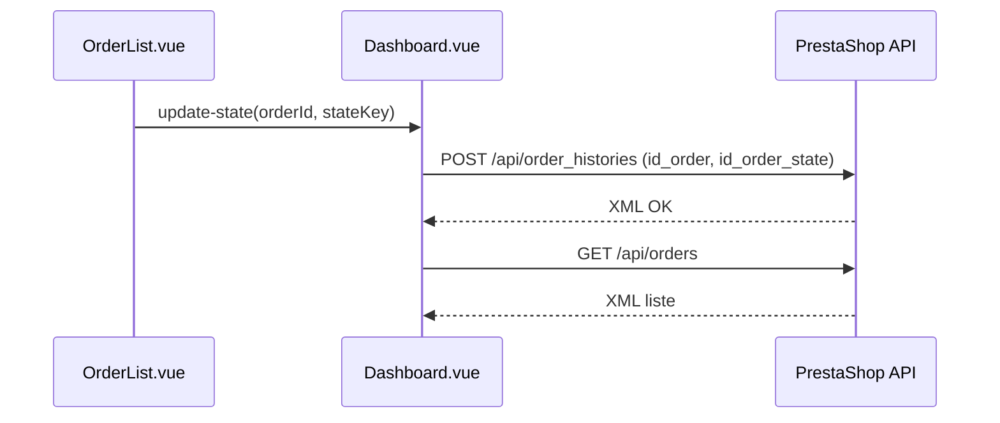

# Commande - ajout gestion etat

## Objectif

Afficher les commandes et permettre de changer leur etat (3 etats uniquement) :
- echec paiement
- paiement effectue
- annule

L'update utilise l'API PrestaShop via la ressource order_histories (comme le backoffice).

## Etapes realisees

1) Charger les commandes + les etats disponibles (order_states).
2) Mapper les 3 etats autorises vers des IDs (par nom ou via variables d'environnement).
3) Afficher un select par commande et envoyer un POST order_histories pour changer l'etat.
4) Rafraichir la liste des commandes.

## Fichiers modifies

- [prestashop-App/src/services/prestashopApi.js](prestashop-App/src/services/prestashopApi.js)
- [prestashop-App/src/pages/Dashboard.vue](prestashop-App/src/pages/Dashboard.vue)
- [prestashop-App/src/components/OrderList.vue](prestashop-App/src/components/OrderList.vue)
- [prestashop-App/src/style.css](prestashop-App/src/style.css)
- [prestashop-App/.env](prestashop-App/.env)

## Details par fichier (fonctions + utilite)

### 1) Normalisation API
Fichier: [prestashop-App/src/services/prestashopApi.js](prestashop-App/src/services/prestashopApi.js)

```js
export const normalizeOrderStates = (payload) => {
  const raw = payload?.prestashop?.order_states?.order_state
  if (!raw) return []

  const list = Array.isArray(raw) ? raw : [raw]
  return list.map((item) => ({
    id: pickText(item.id),
    name: pickLanguageValue(item.name),
  }))
}

export const normalizeOrders = (payload) => {
  const raw = payload?.prestashop?.orders?.order
  if (!raw) return []

  const list = Array.isArray(raw) ? raw : [raw]
  return list.map((item) => ({
    id: pickText(item.id),
    reference: pickText(item.reference),
    currentStateId: pickText(item.current_state),
    totalPaid: pickText(item.total_paid),
    dateAdd: pickText(item.date_add),
  }))
}
```

Utilite:
- Transformer la reponse XML -> JSON en liste simple exploitable par l'UI.
- Extraire id, reference, etat courant, total, date.

### 2) Chargement + update des etats
Fichier: [prestashop-App/src/pages/Dashboard.vue](prestashop-App/src/pages/Dashboard.vue)

```js
const allowedOrderStates = [
  {
    key: "payment_failed",
    label: "Echec paiement",
    aliases: ["echec paiement", "paiement erreur", "payment error", "payment failed"],
  },
  {
    key: "payment_done",
    label: "Paiement effectue",
    aliases: ["paiement effectue", "paiement accepte", "payment accepted", "paid"],
  },
  {
    key: "canceled",
    label: "Annule",
    aliases: ["annule", "annulee", "canceled", "cancelled", "annulation"],
  },
]

const resolveStateId = (states, key, aliases) => {
  const override = envOrderStateOverrides[key]
  if (override) return String(override)

  const normalizedAliases = aliases.map(normalizeStateName)
  const match = states.find((state) =>
    normalizedAliases.includes(normalizeStateName(state.name))
  )
  return match?.id ? String(match.id) : ""
}
```

Utilite:
- Limiter les choix a 3 etats.
- Trouver l'ID PrestaShop correspondant par nom (ou via env).

```js
const loadOrders = async () => {
  const [ordersResult, statesResult] = await Promise.allSettled([
    fetchResource(
      "orders",
      { display: "[id,reference,current_state,total_paid,date_add]" },
      { baseUrl: baseUrl.value, apiKey: apiKey.value }
    ),
    fetchResource("order_states", { display: "[id,name]" }, {
      baseUrl: baseUrl.value,
      apiKey: apiKey.value,
    }),
  ])

  const list = statesResult.status === "fulfilled"
    ? normalizeOrderStates(statesResult.value.json)
    : []

  orderStateOptions.value = buildAllowedStateOptions(list)

  const ordersList = ordersResult.status === "fulfilled"
    ? normalizeOrders(ordersResult.value.json)
    : []

  orders.value = applyOrderStates(ordersList, buildStateMap(list), orderStateOptions.value)
}
```

Utilite:
- Charge commandes + etats.
- Construit les options d'etat autorisees.
- Ajoute stateName et currentStateKey aux commandes.

```js
const updateOrderState = async (payload) => {
  const option = orderStateOptions.value.find((item) => item.key === payload?.stateKey)
  if (!option?.id) return

  const schema = await fetchSchema(baseUrl.value, apiKey.value, "order_histories")
  const xml = buildXmlFromSchema(
    schema,
    { id_order: String(payload.orderId), id_order_state: String(option.id) },
    "order_history"
  )

  await sendXmlResource("order_histories", xml, "POST", {
    baseUrl: baseUrl.value,
    apiKey: apiKey.value,
  })

  await loadOrders()
}
```

Utilite:
- Envoie la mise a jour d'etat via order_histories (comportement BO).
- Recharge la liste apres succes.

### 3) UI des commandes
Fichier: [prestashop-App/src/components/OrderList.vue](prestashop-App/src/components/OrderList.vue)

```js
const emit = defineEmits(["update-state"])
const selectedStates = ref({})

const applyState = (item) => {
  const key = selectedStates.value[item.id]
  if (!key) return
  emit("update-state", { orderId: item.id, stateKey: key })
}
```

Utilite:
- Conserve la selection d'etat par commande.
- Envoie l'action au dashboard pour faire l'update API.

```vue
<select v-model="selectedStates[item.id]">
  <option value="">Choisir un etat</option>
  <option v-for="option in stateOptions" :key="option.key" :value="option.key" :disabled="!option.id">
    {{ option.label }}
  </option>
</select>
```

Utilite:
- Affiche uniquement les 3 etats autorises.
- Desactive un etat si l'ID n'a pas ete mappe.

### 4) Style UI
Fichier: [prestashop-App/src/style.css](prestashop-App/src/style.css)

```css
.card-actions select {
  flex: 1;
  min-width: 0;
}
```

Utilite:
- Garde un layout propre dans les cartes commandes.

### 5) Variables d'environnement (optionnel)
Fichier: [prestashop-App/.env](prestashop-App/.env)

```env
# Optional: override order state IDs for the 3 allowed statuses
# VITE_ORDER_STATE_PAYMENT_FAILED_ID=8
# VITE_ORDER_STATE_PAYMENT_DONE_ID=2
# VITE_ORDER_STATE_CANCELED_ID=6
```

Utilite:
- Forcer l'ID exact d'un etat si le mapping par nom ne marche pas.

## Mini schema (update etat)


