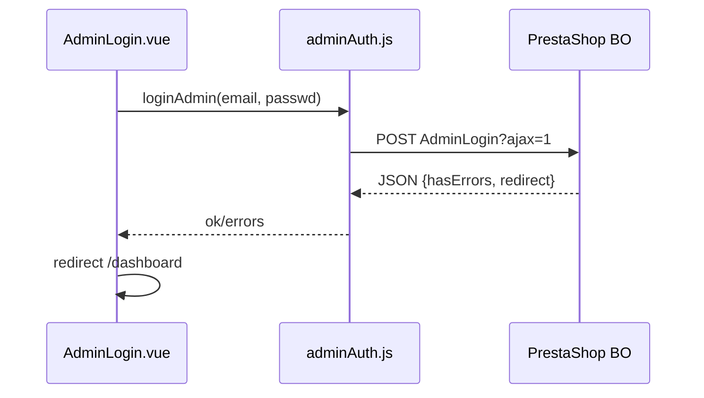

# Guide Login Backoffice (AdminLogin)

Ce document explique comment le login BO a ete implemente, avec les etapes et les points importants.

## Objectif

Afficher la page login en premier, puis ouvrir le dashboard si la session BO est valide.

## Etapes a suivre

1) Configurer les URLs admin
- .env:
  - VITE_PS_ADMIN_BASE_URL=/ps-admin
  - VITE_PS_ADMIN_PROXY_TARGET=http://localhost/prestashop/admin_Ambinintsoa
- vite.config.js: proxy `/ps-admin` -> dossier admin

2) Creer le service login
- Fichier: src/services/adminAuth.js
- Fonction principale: loginAdmin(baseUrl, options)
  - Envoie un POST vers AdminLogin avec `ajax=1`
  - Stocke les cookies avec `credentials: "include"`

3) Creer la page login
- Fichier: src/pages/AdminLogin.vue
- Formulaire avec email + password
- Sur succes: redirection vers `/dashboard`

4) Proteger le dashboard
- Fichier: src/router/index.js
- Guard qui appelle checkAdminSession()
  - Si pas logge -> retour a `/`
  - Si deja logge -> on force `/dashboard`

## API utilisee (AdminLogin)

URL:
- `{ADMIN_BASE}/index.php?controller=AdminLogin`

POST (x-www-form-urlencoded):
- email
- passwd
- submitLogin=1
- ajax=1
- stay_logged_in=1 (optionnel)
- redirect=AdminDashboard (optionnel)

Reponse JSON:
- { hasErrors: false, redirect: "..." }
- { hasErrors: true, errors: ["..."] }

## Verification de session

URL:
- `{ADMIN_BASE}/index.php?controller=AdminDashboard`

Regle:
- Si la reponse contient la page login (header `Login: true` ou marqueurs HTML), session invalide.
- Sinon session OK.

## Points importants

- **Le login BO utilise les identifiants employee**, pas la cle webservice.
- **Toujours `credentials: "include"`** pour garder les cookies.
- **Proxy Vite recommande** pour eviter le CORS en dev.
- **Le dossier admin peut changer** (admin_xxx). Mettre a jour `.env`.
- **Cache session** (30s) pour limiter les appels reseau.

## Schema (mini flux)

## Checklist debug rapide

- VITE_PS_ADMIN_BASE_URL correct ?
- VITE_PS_ADMIN_PROXY_TARGET correct ?
- Le dossier admin est-il bien admin_Ambinintsoa ?
- Cookies presents apres login ?
- checkAdminSession retourne true ?
